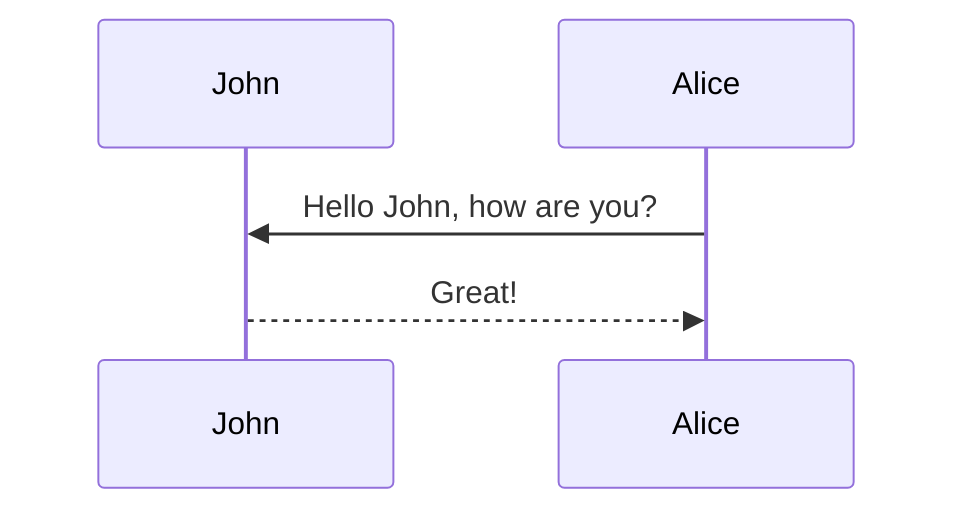

**TL;DR:** We explore the implications of symmetry breaking in data distributions and present a new metric to quantify the amount of symmetry broken. We explore the implications of distributional symmetry breaking for machine learning practitioners. 

## Introduction

Both data augmentation and equivariant neural networks have become popular tools in modern machine learning to enforce symmetries, with equivariant neural networks achieving superior performance across materials science <d-cite key="liao2023equiformerv2"></d-cite>, robotics <d-cite key="wang2024equivariant"></d-cite>, drug discovery <d-cite key="igashov2024equivariant"></d-cite>, fluid dynamics <d-cite key="wangincorporating"></d-cite>, computer vision <d-cite key="esteves2019equivariant"></d-cite>, and beyond. For $g\in G$ a group symmetry transformation, such as a rotation or permutation, a function $$f$$ is equivariant if $$f(gx) = g(fx)$$, and invariant if $$f(gx) = f(x)$$. Similarly, a model $$\text{NN}$$ is equivariant if it is architecturally constrained such that $$\text{NN}(gx)=g\text{NN}(x)$$, tying the predictions for $$x$$ and $$gx$$. Data augmentation may also be used to enforce symmetries by applying a random group element $$g$$ to each input in the training set and its corresponding label, thus encouraging the model to learn equivariant or invariant behavior. 

Both approaches rely on the assumption that the ground truth function $$f$$ is equivariant. However, there is often an implicit assumption that the data distribution itself is symmetric, i.e. $$p(x) \approx p(gx)$$. We refer to violations of this assumption as **distributional symmetry breaking**. In this work, we study distributional symmetry breaking. Our main contributions are:

- **A classifier-based diagnostic:** We introduce a simple two-sample test to measure distributional symmetry breaking.

- **Theoretical analysis:** We show that data augmentation can harm performance under certain distributional conditions.

- **Empirical study:** We demonstrate that widely used 3D datasets are strongly canonicalized.

## Distributional Symmetry Breaking


<div class="caption">
    A visualization of orientation biases.
</div>
The figure above shows examples of **distributional symmetry breaking**. Baseballs are likely to occur in any orientation in photos, and are therefore uniform across orbits. Coffee mugs are more likely to appear with the handle on the side, illustrating distributional symmetry breaking. The middle shows an example of **canonicalization**, where an object only ever apprears in one canonical orientation. This is the strongest form of distributional symmetry breaking. Canonicalization can also be **inherent**, such as a digit's orientation that determines whether it is a 6 or a 9, or **user-defined**, such as the orientiation of a crystal lattice. Distributional symmetry breaking may lead equivariant methods or data augmentation to discard useful information. For example, classifying 6s and 9s in MNIST is easy when the digits appear in their natural orientation, but it becomes harder under rotational augmentation.

## Proposed Metric

Thus, we propose a metric to answer the question: **how much does the data distribution break symmetry?**.  We define a metric $$m(p_X)$$ which measures how close the data distribution $p_X$ is to being symmetric. Formally, the symmetrized density is

$$
\bar{p}_X(x) := \int_{g\in G}p_X(gx)dg
$$

We can obtain samples from $$\bar{p}_X(x)$$ by applying random $$G$$-augmentations. We would like $$m(p_X)$$ to approximate some notion of distance $$d$$ between $$p_X$$ and $$\bar{p}_X$$. Intuitively, if $$d$$ is small, the dataset is already symmetric. If $$d$$ is large, some orientations or transformations are more likely than others, illustrating distributional symmetry breaking.

<d-cite key="chiu2023nonparametric"></d-cite> sets $$d$$ to be the maximum mean discrepancy (MMD) with respect to some choice of kernel, corresponding to a non-parametric two sample statistical test. However, there is not always a clear choice of kernel. Thus, we propose a two sample classifier test, a common tool for detecting and quantifying distribution shift in machine learning <d-cite key="twosampletest"></d-cite>. 

Our approach is both simple and interpretable as follows:
1. Split the dataset in half
2. Apply random transformations $$g \in G$$ to one half to create the augmented class.
3. Train a small neural network to distinguish between original and transformed samples.
4. Use the **test accuracy** as the metric:

$$
m(p_X) := \text{accuracy of classifier distinguishing } (p_X, \bar{p}_X)
$$

Intuitively, if the dataset is symmetric, the classifier can't tell the difference ($$m(p_X) \approx 0.5$$). If it is canonicalized, the classifier can easily tell ($$m(p_X) \approx 1).

<div style="display: flex; justify-content: space-between; align-items: flex-start; gap: 1rem;">

  <figure style="flex: 1; text-align: center;">
    
    <figcaption>A visualization of orientation biases.</figcaption>
  </figure>

  <figure style="flex: 1; text-align: center;">
    
    <figcaption>The classifier test setup for symmetrized vs original data.</figcaption>
  </figure>

</div>

## Images and Figures

Its generally a better idea to avoid linking to images hosted elsewhere - links can break and you
might face losing important information in your blog post.
To include images in your submission in this way, you must do something like the following:

```markdown

```

which results in the following image:



To ensure that there are no namespace conflicts, you must save your asset to your unique directory
`/assets/img/2025-04-27-[SUBMISSION NAME]` within your submission.

Please avoid using the direct markdown method of embedding images; they may not be properly resized.
Some more complex ways to load images (note the different styles of the shapes/shadows):

<div class="row mt-3">
    <div class="col-sm mt-3 mt-md-0">
        
    </div>
    <div class="col-sm mt-3 mt-md-0">
        
    </div>
</div>
<div class="caption">
    A simple, elegant caption looks good between image rows, after each row, or doesn't have to be there at all.
</div>

<div class="row mt-3">
    <div class="col-sm mt-3 mt-md-0">
        
    </div>
    <div class="col-sm mt-3 mt-md-0">
        
    </div>
</div>

<div class="row mt-3">
    <div class="col-sm mt-3 mt-md-0">
        
    </div>
    <div class="col-sm mt-3 mt-md-0">
        
    </div>
    <div class="col-sm mt-3 mt-md-0">
        
    </div>
</div>

### Interactive Figures

Here's how you could embed interactive figures that have been exported as HTML files.
Note that we will be using plotly for this demo, but anything built off of HTML should work
(**no extra javascript is allowed!**).
All that's required is for you to export your figure into HTML format, and make sure that the file
exists in the `assets/html/[SUBMISSION NAME]/` directory in this repository's root directory.
To embed it into any page, simply insert the following code anywhere into your page.

```markdown

```

For example, the following code can be used to generate the figure underneath it.

```python
import pandas as pd
import plotly.express as px

df = pd.read_csv('https://raw.githubusercontent.com/plotly/datasets/master/earthquakes-23k.csv')

fig = px.density_mapbox(
    df, lat='Latitude', lon='Longitude', z='Magnitude', radius=10,
    center=dict(lat=0, lon=180), zoom=0, mapbox_style="stamen-terrain")
fig.show()

fig.write_html('./assets/html/2026-04-27-distill-example/plotly_demo_1.html')
```

And then include it with the following:

```html

<div class="l-page">
  <iframe
    src="{{ 'assets/html/2026-04-27-distill-example/plotly_demo_1.html' | relative_url }}"
    frameborder="0"
    scrolling="no"
    height="600px"
    width="100%"
  ></iframe>
</div>

```

Voila!

<div class="l-page">
  <iframe src="{{ 'assets/html/2026-04-27-distill-example/plotly_demo_1.html' | relative_url }}" frameborder='0' scrolling='no' height="600px" width="100%"></iframe>
</div>

## Citations

Citations are then used in the article body with the `<d-cite>` tag.
The key attribute is a reference to the id provided in the bibliography.
The key attribute can take multiple ids, separated by commas.

The citation is presented inline like this: <d-cite key="gregor2015draw"></d-cite> (a number that displays more information on hover).
If you have an appendix, a bibliography is automatically created and populated in it.

Distill chose a numerical inline citation style to improve readability of citation dense articles and because many of the benefits of longer citations are obviated by displaying more information on hover.
However, we consider it good style to mention author last names if you discuss something at length and it fits into the flow well — the authors are human and it’s nice for them to have the community associate them with their work.

---

## Footnotes

Just wrap the text you would like to show up in a footnote in a `<d-footnote>` tag.
The number of the footnote will be automatically generated.<d-footnote>This will become a hoverable footnote.</d-footnote>

---

## Code Blocks

This theme implements a built-in Jekyll feature, the use of Rouge, for syntax highlighting.
It supports more than 100 languages.
This example is in C++.
All you have to do is wrap your code in a liquid tag:


 <br/> code code code <br/> 


The keyword `linenos` triggers display of line numbers. You can try toggling it on or off yourself below:



int main(int argc, char const \*argv[])
{
string myString;

    cout << "input a string: ";
    getline(cin, myString);
    int length = myString.length();

    char charArray = new char * [length];

    charArray = myString;
    for(int i = 0; i < length; ++i){
        cout << charArray[i] << " ";
    }

    return 0;

}



---

## Diagrams

This theme supports generating various diagrams from a text description using [mermaid.js](https://mermaid-js.github.io/mermaid/){:target="\_blank"} directly.
Below, we generate examples of such diagrams using [mermaid](https://mermaid-js.github.io/mermaid/){:target="\_blank"} syntax.

**Note:** To enable mermaid diagrams, you need to add the following to your post's front matter:

```yaml
mermaid:
  enabled: true
  zoomable: true # optional, for zoomable diagrams
```

The diagram below was generated by the following code:


````

````


---

## Blockquotes

<blockquote>
    We do not grow absolutely, chronologically. We grow sometimes in one dimension, and not in another, unevenly. We grow partially. We are relative. We are mature in one realm, childish in another.
    —Anais Nin
</blockquote>

---

## Layouts

The main text column is referred to as the body.
It is the assumed layout of any direct descendants of the `d-article` element.

<div class="fake-img l-body">
  <p>.l-body</p>
</div>

For images you want to display a little larger, try `.l-page`:

<div class="fake-img l-page">
  <p>.l-page</p>
</div>

All of these have an outset variant if you want to poke out from the body text a little bit.
For instance:

<div class="fake-img l-body-outset">
  <p>.l-body-outset</p>
</div>

<div class="fake-img l-page-outset">
  <p>.l-page-outset</p>
</div>

Occasionally you’ll want to use the full browser width.
For this, use `.l-screen`.
You can also inset the element a little from the edge of the browser by using the inset variant.

<div class="fake-img l-screen">
  <p>.l-screen</p>
</div>
<div class="fake-img l-screen-inset">
  <p>.l-screen-inset</p>
</div>

The final layout is for marginalia, asides, and footnotes.
It does not interrupt the normal flow of `.l-body`-sized text except on mobile screen sizes.

<div class="fake-img l-gutter">
  <p>.l-gutter</p>
</div>

---

## Other Typography?

Emphasis, aka italics, with _asterisks_ (`*asterisks*`) or _underscores_ (`_underscores_`).

Strong emphasis, aka bold, with **asterisks** or **underscores**.

Combined emphasis with **asterisks and _underscores_**.

Strikethrough uses two tildes. ~~Scratch this.~~

1. First ordered list item
2. Another item

- Unordered sub-list.

1. Actual numbers don't matter, just that it's a number
   1. Ordered sub-list
2. And another item.

   You can have properly indented paragraphs within list items. Notice the blank line above, and the leading spaces (at least one, but we'll use three here to also align the raw Markdown).

   To have a line break without a paragraph, you will need to use two trailing spaces.
   Note that this line is separate, but within the same paragraph.
   (This is contrary to the typical GFM line break behavior, where trailing spaces are not required.)

- Unordered lists can use asterisks

* Or minuses

- Or pluses

[I'm an inline-style link](https://www.google.com)

[I'm an inline-style link with title](https://www.google.com "Google's Homepage")

[I'm a reference-style link][Arbitrary case-insensitive reference text]

[I'm a relative reference to a repository file](../blob/master/LICENSE)

[You can use numbers for reference-style link definitions][1]

Or leave it empty and use the [link text itself].

URLs and URLs in angle brackets will automatically get turned into links.
http://www.example.com or <http://www.example.com> and sometimes
example.com (but not on Github, for example).

Some text to show that the reference links can follow later.

[arbitrary case-insensitive reference text]: https://www.mozilla.org
[1]: http://slashdot.org
[link text itself]: http://www.reddit.com

Here's our logo (hover to see the title text):

Inline-style:


Reference-style:
![alt text][logo]

[logo]: https://github.com/adam-p/markdown-here/raw/master/src/common/images/icon48.png "Logo Title Text 2"

Inline `code` has `back-ticks around` it.

```javascript
var s = "JavaScript syntax highlighting";
alert(s);
```

```python
s = "Python syntax highlighting"
print(s)
```

```
No language indicated, so no syntax highlighting.
But let's throw in a <b>tag</b>.
```

Colons can be used to align columns.

| Tables        |      Are      |  Cool |
| ------------- | :-----------: | ----: |
| col 3 is      | right-aligned | $1600 |
| col 2 is      |   centered    |   $12 |
| zebra stripes |   are neat    |    $1 |

There must be at least 3 dashes separating each header cell.
The outer pipes (|) are optional, and you don't need to make the
raw Markdown line up prettily. You can also use inline Markdown.

| Markdown | Less      | Pretty     |
| -------- | --------- | ---------- |
| _Still_  | `renders` | **nicely** |
| 1        | 2         | 3          |

> Blockquotes are very handy in email to emulate reply text.
> This line is part of the same quote.

Quote break.

> This is a very long line that will still be quoted properly when it wraps. Oh boy let's keep writing to make sure this is long enough to actually wrap for everyone. Oh, you can _put_ **Markdown** into a blockquote.

Here's a line for us to start with.

This line is separated from the one above by two newlines, so it will be a _separate paragraph_.

This line is also a separate paragraph, but...
This line is only separated by a single newline, so it's a separate line in the _same paragraph_.

